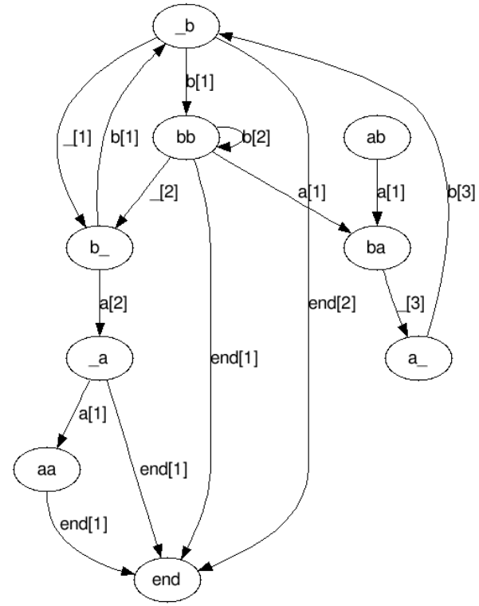

# Обработка последовательностей
### Цели работы:

1. Реализовать алгоритм LSTM.
2. Сравнить решение с марковской цепью (автоматом).
3. Анализ результатов.

### Набор данных:
Выберите любой доступный достаточно длинный текст. Разбейте текст по предложениям на строки. Максимально сократите число различных символов в тексте: приведите все буквы к нижнему регистру, уберите лишние знаки препинания. Если используемая модель будет плохо или медленно обучаться, разбейте текст на строки по словам. В таком случае в качестве набора данных можно взять какой-либо словарь.

Используя one-hot кодирование получите векторное представление каждого символа. В том числе и символа конца строки (точки или пробела), после которого генерация строки прекращается. Хотя её также следует искусственно ограничить максимальной длинной строки.

### Задание
Обучите модель на выбранном тексте. И используйте обученную модель для генерации продолжения строки по её началу. Задачу стоит решить двумя моделями: LSTM и марковской цепью (автоматом).

### LSTM
Обучите LSTM предсказывать следующий символ по предыдущим. Обучать стоит по одной строке. Для обучения можно использовать любую подходящую функцию ошибки (например *MSE* или *CrossEntropy*). Для обучения используйте адаптивный градиентный спуск.

Для предсказания следующего символа можно использовать *arg-max* вектора ответа, либо использовать случайный символ с вероятностью полученной *soft-arg-max*-ом.

В реализации разрешается использовать **tf.keras.layers.RNN**

### Марковская цепь
Выберите число последних символов n, которые будут учитываться для генерации нового символа. Не путайте это число с числом символов, из которых будет генерироваться продолжение строки, они могут различаться!

Обучите марковскую цепь — автомат, в котором состояние это суффикс текущей строки длины *n*, а переходы — очередной генерируемый символ. Каждый переход снабжён некоторым числовым значением — вероятностью перехода, которую и нужно оценить на выбранном тексте.

Для предсказания следующего символа можно использовать arg-max вектора вектора вероятностей перехода из текущего состояния, либо использовать случайный символ с соответствующей вероятностью.

### Пример
Рассмотрим множество строк с алфавитом {*“a”*, *“b”*, *“_”*, *end*}, где end — символ конца строки:

```
ba_b
bbb_a
bbba_bb
aba_b
bb_b_aa
```

Тогда для полученного множества строк можно построить следующий автомат:



В квадратных скобках указан вес перехода — число раз, когда он встретился в множестве строк. Переходы с весом ноль не отображены. Вес следует преобразовать в вероятность простым нормированием на сумму весов, либо с аддитивным сглаживанием, чтобы не было переходов с вероятностью ноль. Обратите внимание, что состояние с концом строки только одно, так как после попадания в него генерация текущей строки прекращается.