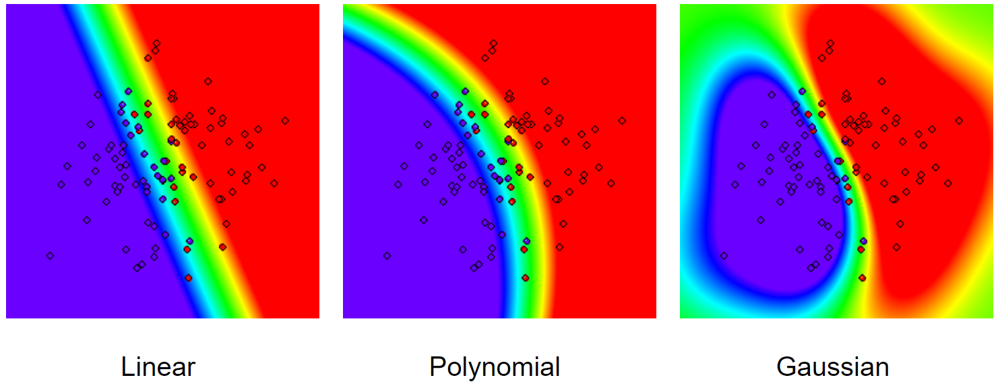

# [Метод опорных векторов](report.ipynb)
### Цели работы:

1. реализовать метод опорных векторов;
2. настроить гиперпараметры: параметр ядра и коэффициент опорных векторов;
3. анализ результатов.

### Наборы данных
Используйте наборы данных [chips.csv](datasets/chips.csv) (определение брака при производстве микрочипов) и [geyser.csv](datasets/geyser.csv) (данные об извержении Йеллоустоунского вулкана) для тестирования вашего классификатора.

### Задание
Алгоритм и его настройка

Реализуйте *метод опорных векторов* и три ядра для него: 

1. линейное ядро;
2. полиномиальное ядро со степенью;
3. гауссово ядро с радиальной базисной функцией.

Для каждого набора данных и ядра найдите лучшие гиперпараметры ядра: степень полинома для полиномиального ядра {2, 3, 4, 5} и ![\beta = \left[1, \ldots, 5\right]](https://latex.codecogs.com/svg.latex?\beta%20=%20\left[1,%20\ldots,%205\right]) для гауссова ядра %20=%20exp(-\beta%20{||x%20-%20y||}^2)), а также ограничения на коэффициенты опорных векторов C=[0.05, 0.1, 0.5, 1.0, 5.0, 10.0, 50.0, 100.0].

Для выбора наилучших параметров используйте точность (*accuracy*) посчитанную при перекрёстной проверке.

После нахождения оптимальных параметров для каждого набора данных и ядра выведите найденную точность, гиперпараметры алгоритма, при которых она была достигнута.

#### Анализ

Для каждого набора данных и каждого ядра нарисуйте, как реализованный алгоритм (с лучшими прочими гиперпараметрами) работает в **исходном пространстве**. Для изображения классификатор следует обучать на всём наборе данных, тестовым множеством в этом случае будет всё пространство.

### Пример

Необязательно использовать цвета, можно изобразить контуры разделяющей поверхности, главное чтобы было видно её форму и были различимы реальные классы объектов.

